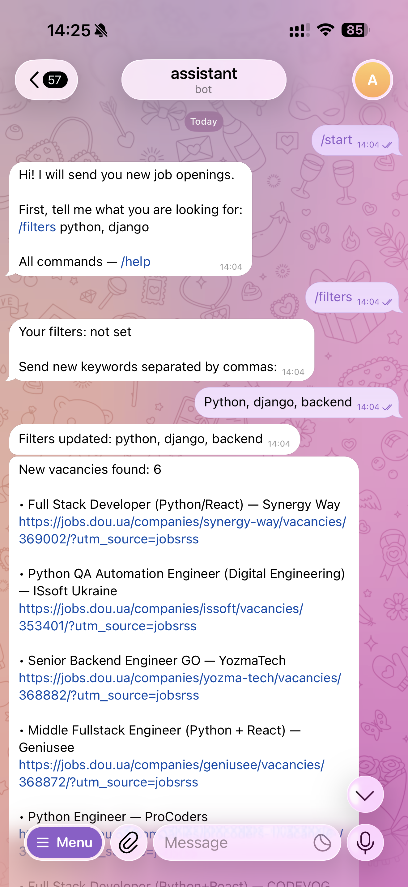
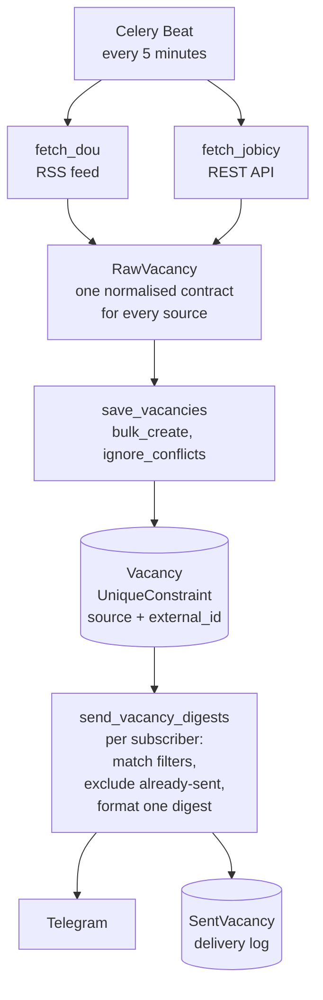

# JobBot

 

A Telegram bot that watches job boards and pushes new vacancies to you within minutes of publication — filtered by your own keywords, so you only get what you're actually looking for.

## Why

Job hunting rewards being early. The usual routine is refreshing several job boards throughout the day and hoping to catch a posting before dozens of other applicants do. This bot does that watching instead: it polls the sources every five minutes, matches new postings against each subscriber's keywords, and sends only what hasn't been sent before.

## Features

- **Continuous monitoring** — new vacancies arrive within minutes of being published, no manual refreshing
- **Personal keyword filters** — set your own terms and receive only matching vacancies
- **No repeats** — every vacancy is delivered once, even across restarts
- **Pause and resume** — stop the flow without losing your filters
- **Two interface languages** — Ukrainian and English

## Example



## How it works



The three tasks run as a Celery `chain`, so fetching always completes before delivery — rather than relying on separate schedules and hoping they don't overlap.

## Key design decisions

**Deduplication lives in the database, not in Python.**
Each vacancy carries a `source` and the source's own `external_id`, under a `UniqueConstraint`. Inserts use `bulk_create(ignore_conflicts=True)`, so re-fetching the same feed is a no-op at the database level. A "check if it exists, then insert" approach in application code would be both slower and racy — two workers could pass the check simultaneously and both insert.

**Delivery state is a table, not a timestamp.**
`SentVacancy` records what went to whom. The alternative — "send everything published in the last N minutes" — silently loses vacancies whenever the worker is down for longer than the window. With an explicit log, a delayed run simply catches up.

**Sources are adapters behind one contract.**
DOU publishes an RSS feed; Jobicy exposes a JSON API. Each module in `vacancies/sources/` parses its own format and returns `list[RawVacancy]`. Everything downstream — saving, filtering, formatting — is written against that dataclass and knows nothing about feeds or endpoints. Adding a third source means adding one module, not touching the pipeline.

**Async ORM inside aiogram handlers.**
aiogram handlers run in an event loop, so every database call uses the async API (`aget_or_create`, `asave`, `abulk_create`, `async for`). Calling the synchronous ORM there would block the loop and raise `SynchronousOnlyOperation`.

**Failures are isolated per record and per subscriber.**
One malformed RSS entry skips that entry, not the rest of the feed. One subscriber who blocked the bot doesn't stop the broadcast — they're marked inactive and the loop continues. Telegram rate limits (`TelegramRetryAfter`) are respected with a bounded retry rather than unlimited recursion.

**Empty filters send nothing.**
A subscriber with no keywords receives no digest. Treating "no filter" as "match everything" would turn the bot into a firehose — the opposite of what it's for.

## Testing

24 tests, run against a real PostgreSQL instance in CI on every push. The suite is organised around the guarantees the pipeline depends on rather than around code coverage:

**Source parsing** (`test_sources.py`)
Feed entries are turned into `RawVacancy` correctly — titles split into position, company and location; HTML entities unescaped and tags stripped; publication dates parsed as timezone-aware UTC. Malformed entries are skipped without aborting the rest of the feed.

**Saving and filtering** (`test_services.py`)
Re-saving the same vacancy creates no duplicate, which is what makes polling every five minutes safe. Keyword matching is case-insensitive and matches any keyword rather than all of them. A subscriber with no filters produces no digest — the deliberate choice not to treat "no filter" as "everything".

**Delivery** (`test_sender.py`)
Only unsent vacancies reach a subscriber, and sending records them in `SentVacancy` so the next run skips them. A subscriber who blocked the bot is marked inactive instead of failing the broadcast.

```
docker compose exec web pytest
```

## Tech stack

- **Core:** Python 3.12, Django, PostgreSQL
- **Bot:** aiogram 3 (async, FSM for multi-step input)
- **Scheduling:** Celery + Celery Beat, Redis as broker
- **Sources:** feedparser (DOU RSS), httpx (Jobicy API)
- **Testing:** pytest, pytest-django, pytest-asyncio
- **Code quality:** Ruff, mypy with django-stubs
- **Infra:** Docker, Docker Compose
- **Config:** python-decouple

## Bot commands

| Command | Description |
|---|---|
| `/start` | Subscribe — also resumes delivery after `/pause` |
| `/filters` | Show your current filters and set new ones |
| `/filters python, django, junior` | Set filters directly in one message |
| `/pause` | Stop receiving vacancies without losing your filters |
| `/help` | Show available commands |
| `/ua`, `/en` | Switch interface language |

## Getting started

### Prerequisites

- Docker and Docker Compose
- A Telegram bot token from [@BotFather](https://t.me/BotFather)

### Setup

1. Clone the repository:
```
git clone https://github.com/katabrovkova952-blip/job-vacancy-bot.git
cd job-vacancy-bot
```

2. Copy the example environment file and fill in your values:
```
cp .env.example .env
```
Required: `SECRET_KEY`, `BOT_TOKEN`, and the database credentials (`DB_NAME`, `DB_USER`, `DB_PASSWORD`).

3. Build and start:
```
docker compose up --build
```
Migrations run automatically on startup.

Then open Telegram, find your bot, and send `/start`.

### Code quality

```
docker compose exec web ruff check .
docker compose exec web mypy .
```

Linting, type checking, and tests run automatically in CI on every push.

## Project structure

```
├── config/              # Settings, Celery app, beat schedule
├── bot/
│   ├── handlers/        # aiogram command handlers
│   ├── management/      # Django command that runs the bot
│   └── sender.py        # Digest formatting and delivery
├── vacancies/
│   ├── sources/         # One adapter per job board
│   ├── services.py      # Saving and filtering logic
│   ├── tasks.py         # Celery tasks
│   └── tests/
├── Dockerfile
└── docker-compose.yml
```
